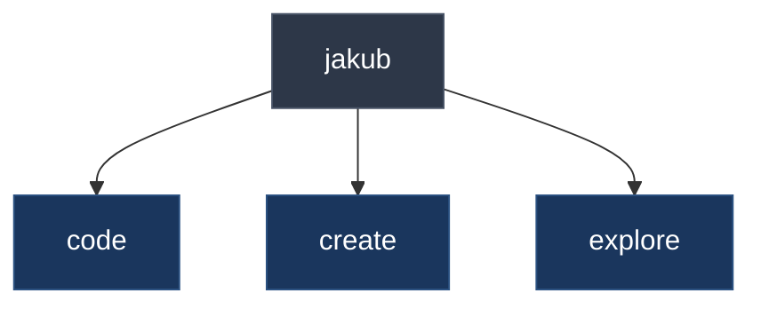

<div align="center">



**building digital experiences**

```mermaid
gitgraph
    commit id: "start"
    commit id: "learn"
    commit id: "build"
    commit id: "create"
    commit id: "..."
```

*warsaw, poland*

</div>
